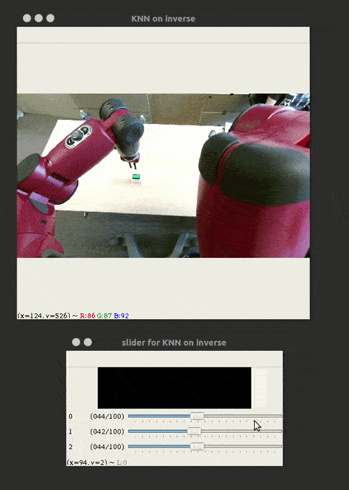

# State Representation Learning Zoo with PyTorch (part of S-RL Toolbox)

A collection of State Representation Learning (SRL) methods for Reinforcement Learning, written using PyTorch.



SRL Zoo Documentation: https://srl-zoo.readthedocs.io/

S-RL Toolbox Documentation: https://s-rl-toolbox.readthedocs.io/

S-RL Toolbox Repository: https://github.com/araffin/robotics-rl-srl


Available methods:

- Autoencoder (reconstruction loss)
- Denoising Autoencoder (DAE)
- Forward Dynamics model
- Inverse Dynamics model
- Reward prediction loss
- Variational Autoencoder (VAE) and beta-VAE
- SRL with Robotic Priors + extensions (stereovision, additional priors)
- Supervised Learning
- Principal Component Analysis (PCA)
- Triplet Network (for stereovision only)
- Combination and stacking of methods
- Random Features
- **[experimental]** Reward Prior, Episode-prior, Perceptual Similarity loss (DARLA), Mutual Information loss

Related papers:
- "S-RL Toolbox: Environments, Datasets and Evaluation Metrics for State Representation Learning" (Raffin et al., 2018) [https://arxiv.org/abs/1809.09369](https://arxiv.org/abs/1809.09369)
- "State Representation Learning for Control: An Overview" (Lesort et al., 2018), link: [https://arxiv.org/pdf/1802.04181.pdf](https://arxiv.org/pdf/1802.04181.pdf)

<a href="https://drive.google.com/file/d/153oxiwHyK2W9nU3avEi0b0O4qjo7WD0X/view"></a>

## Documentation

Documentation is available online: [https://srl-zoo.readthedocs.io/](https://srl-zoo.readthedocs.io/)

## Installation

Please read the [documentation](https://s-rl-toolbox.readthedocs.io/) for more details, we provide anaconda env files and docker images.

## Learning a State Representation

To learn a state representation, you need to enforce constrains on the representation using one or more losses. For example, to train an autoencoder, you need to use a reconstruction loss.
Most losses are not exclusive, that means you can combine them.

All losses are defined in `losses/losses.py`. The available losses are:

- autoencoder: reconstruction loss, using current and next observation
- denoising autoencoder (dae): same as for the auto-encoder, except that the model reconstruct inputs from
                             noisy observations containing a random zero-pixel mask
- vae: (beta)-VAE loss (reconstruction + kullback leiber divergence loss)
- inverse: predict the action given current and next state
- forward: predict the next state given current state and taken action
- reward: predict the reward (positive or not) given current and next state
- priors: robotic priors losses (see "Learning State Representations with Robotic Priors")
- triplet: triplet loss for multi-cam setting (see *Multiple Cameras* section in the doc)

**[Experimental]**
- reward-prior: Maximises the correlation between states and rewards (does not make sense for sparse reward)
- episode-prior: Learn an episode-agnostic state space, thanks to a discriminator distinguishing states from same/different episodes
- perceptual similarity loss (for VAE):  Instead of the reconstruction loss in the beta-VAE loss, it
uses the distance between the reconstructed input and real input in the embedding of a pre-trained DAE.
 - mutual information loss: Maximises the mutual information between states and rewards


All possible arguments can be display using `python train.py --help`. You can limit the training set size (`--training-set-size` argument), change the minibatch size (`-bs`), number of epochs (`--epochs`), ...

## Datasets: Simulated Environments and Real Robots

Although the data can be generated easily using the RL repo in simulation (cf [Generating Data](https://s-rl-toolbox.readthedocs.io/en/latest/guide/envs.html#generating-data)), we provide datasets with a real baxter:

- [Dataset 1](https://mega.nz/#!kN8gTbDQ!s0dRO5TmsNAorIhSsPvPeflaH-r7uYPKgUF2c5Fxxqk)
- [Dataset 2](https://mega.nz/#!AcVkCJgA!mPzXkY3jkM3BPfCN5LGSi9pZfD6urf0m5wTCtkk1_uk) with multiple cameras


### Examples

You can download an example dataset [here](https://drive.google.com/open?id=154qMJHgUnzk0J_Hxmr2jCnV1ipS7o1D5).

Train an inverse model:
```
python train.py --data-folder data/path/to/dataset --losses inverse
```

Train an autoencoder:
```
python train.py --data-folder data/path/to/dataset --losses autoencoder
```

Combining an autoencoder with an inverse model is as easy as:
```
python train.py --data-folder data/path/to/dataset --losses autoencoder inverse
```

You can as well specify the weight of each loss:
```
python train.py --data-folder data/path/to/dataset --losses autoencoder:1 inverse:10
```

Please read the [documentation](https://s-rl-toolbox.readthedocs.io/) for more examples.


## Running Tests

Download the test datasets [kuka_gym_test](https://drive.google.com/open?id=154qMJHgUnzk0J_Hxmr2jCnV1ipS7o1D5) and [kuka_gym_dual_test](https://drive.google.com/open?id=15Fhqr4-kai4b8qQWiq2mEAWW5ZqH5qID) and put it in `data/` folder.
```
./run_tests.sh
```


## Troubleshooting

### CUDA out of memory error

1.  python train.py --data-folder data/staticButtonSimplest
```
RuntimeError: cuda runtime error (2) : out of memory at /b/wheel/pytorch-src/torch/lib/THC/generic/THCStorage.cu:66
```

SOLUTION 1: Decrease the batch size, e.g. 32-64 in GPUs with little memory.

SOLUTION 2 Use simple 2-layers neural network model
python train.py --data-folder data/staticButtonSimplest --model-type mlp
